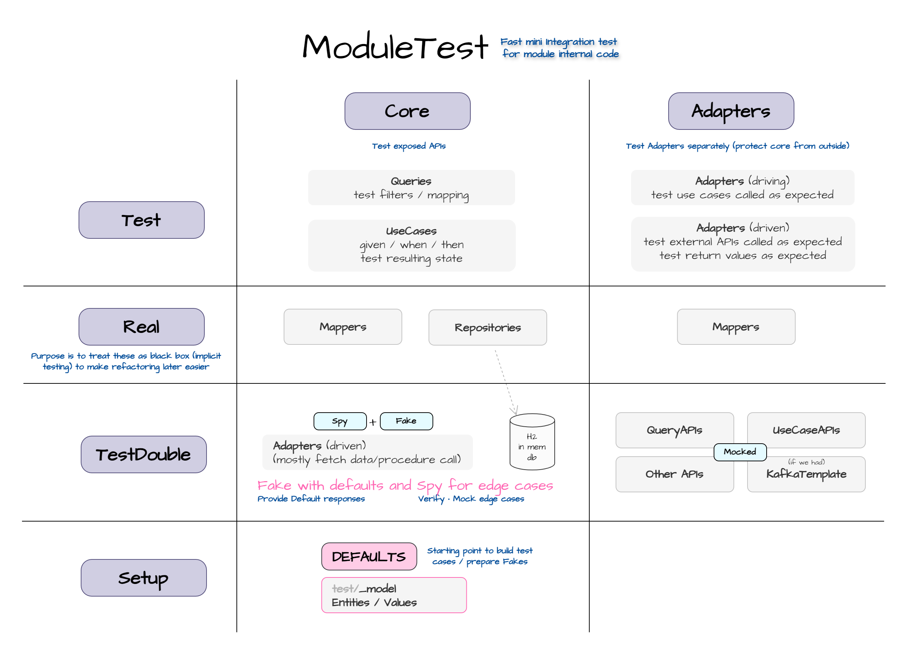

# General 

A single-module approach, separating parts using ArchUnit where needed.

See ADRs in /adr.

# Setup

## Prerequisites
* java 23
* setup and clean install api-train-app

## Steps
1. Clean install this maven module, it will add content to /target/generated-sources
2. Mark /target/generated-sources/java as "Generated sources root"
3. Create a launcher for be.gert.trainapp.sm.TrainAppApplication with profile localhost
4. Start the application (will run on port 8080 by default)

# App module layout overview
Generally, we are using the hexagonal/ports & adapters setup per module.

- UseCases/Queries as "in/driven" adapter for Use case APIs (rest controller port)
  - No separate controllers to reduce mapping load
- UseCases as "in/driven" adapter for public exposed events 
- Adapters to translate external/other module APIs to our internally understood context
- An exception is made for JPA which is included without adapters to reduce the mapping load

(more details in adrs)

# App testing overview
Testing is divided into two main categories.
1. Core tests: test uses cases and queries (everything which is exposed)
2. Adapter tests: test adapters which will translate external concerns to 
'clean' models understood in our module's terms

(more details in adrs)

